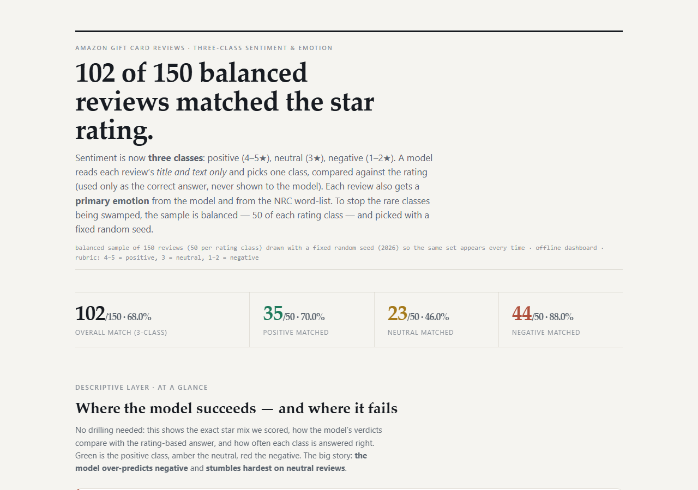

# Amazon Gift Card Review Classifier: Three-Class Sentiment + Emotion

An LLM-based sentiment **and** word-list emotion classifier over the **Amazon Reviews 2023** `Gift_Cards` category, with scoreable, reproducible output and a self-contained offline dashboard.

The **model is never shown the star rating**. Every review is classified from its `title` + `text` only; the rating is used **afterward** purely as the ground-truth label for scoring. This keeps the classifier honest: it has to actually read the words.

- **Headline result (balanced 150-review sample, seed 2026):** **68% overall**: Positive **70%**, Neutral **46%**, Negative **88%**.
- **Headline emotion result:** the LLM's chosen emotion and the NRC word-list emotion agree on **15 of 150 (10%)**, because the two methods work fundamentally differently (see Q3).



*The final dashboard (`Gift_Card_Classifier_Dashboard_v5.html`): headline, summary KPIs, and the "where it succeeds and fails" at-a-glance charts.*

---

## Repository contents

| File | What it is |
|------|-----------|
| `README.md` | This report |
| `classifier.py` | The LLM classifier + prompt (3-class sentiment, plus one primary emotion in a single call) |
| `three_class_run.py` | Runs the classifier + both emotion methods over the balanced sample and writes `three_class_results.json` |
| `nrc_lexicon.py` | The NRC word-list emotion scorer (no model calls needed) |
| `generate_dashboard4.py` | Builds the final HTML dashboard from the saved results |
| `Gift_Card_Classifier_Dashboard_v5.html` | **The final dashboard** (single self-contained offline file, opens by double-click) |
| `three_class_results.json` | Raw output of one balanced run (the numbers every chart is built from) |
| `scoring_results.json`, `scoring_results.csv` | The earlier "lopsided" first-100 run (see Q1) |
| `edge_cases.py` | Small demo of tricky reviews (sarcasm, conflicting title/text, etc.) |
| `assets/` | Screenshots of the dashboard used in this report |

## Data source

The dataset is the **Amazon Reviews 2023** collection (Julian McAuley, UC San Diego), specifically the Gift Cards category:

- Raw data: `https://mcauleylab.ucsd.edu/public_datasets/data/amazon_2023/raw/review_categories/Gift_Cards.jsonl.gz`
- Dataset page: https://amazon-reviews-2023.github.io/ and the McAuley lab datasets page.

The Gift Card file contains **152,410 reviews**. Fields used here: `rating` (integer 1-5), `title`, `text`. The `rating` column is the ground truth and is never sent to the model.

---

## Method

1. **Three-class rubric** (carried through every step): **4-5★ = positive, 3★ = neutral, 1-2★ = negative.** The model is told in its prompt that it is never given a star rating and must decide purely from the words, including edge cases (conflicting title/text, terse, informal, or sarcastic reviews).
2. **Balanced sampling.** Reading the first rows in file order over-represents 5★ reviews (rare classes get almost no examples). Instead this run samples from the *entire* file with `random.seed(2026)` to get an even **50/50/50 split** across the three rating classes, "around 50 per class", fixed so the same set is picked every time.
3. **Two independent emotion methods** run on every review:
   - **Method 1 (LLM):** the model returns sentiment + one primary emotion (one of the 8 NRC categories) in a single call.
   - **Method 2 (word list, NRC Lexicon):** each review's words are scored against the **NRC Emotion Lexicon (EmoLex v0.92**, Saif Mohammad, NRC Canada, https://saifmohammad.com/WebDocs/Lexicons/NRC-Emotion-Lexicon.zip) across the 8 categories; the highest-scoring emotion is the word-list prediction. No additional model calls.
4. **One balanced run** was executed and its raw output saved (`three_class_results.json`). The dashboard is generated **from that saved output**, so every number you see on the page is, by construction, identical to the saved run (verified in the browser, below).

---

## Results (every number matches the saved output)

Using the seed-2026 balanced sample, the star/rubric composition is:

| Review size/stars | 1★ | 2★ | 3★ | 4★ | 5★ | Total |
|---|---|---|---|---|---|---|
| Reviews (balanced) | 43 | 7 | 50 | 2 | 48 | 150 |

Even though the sample is balanced *by class*, it is still skewed *within* a class: negatives are mostly 1★ and positives are mostly 5★; a plain statement of what the balanced set actually looks like.

### Confusion matrix (true class from the rating vs. what the model predicted)

| True (rating) \ Predicted | predicted **positive** | predicted **neutral** | predicted **negative** | Correct |
|---|---|---|---|---|
| **positive** (4-5★) | **35** | 15 | 0 | **70%** |
| **neutral** (3★) | 1 | **23** | 26 | **46%** |
| **negative** (1-2★) | 0 | 6 | **44** | **88%** |
| **Model predicted in total** | 36 | 44 | 70 | **68% overall (102/150)** |

Read-out of the matrix:

- Only **102 of 150 (68%)** match the rating-based answer.
- The model never calls a positive review negative, nor a negative review positive; those corners of the matrix are **0**. Its errors go *toward the middle* (positive→neutral 15, negative→neutral 6).
- The big failure is **neutral**: **26 of 50** true-3★ reviews get read as **negative** (the single largest error cell). Complaint-laden 3★ text is genuinely hard (it says *why* the product is only okay).
- Net effect: the model predicts **negative far more often than the ratings support**; it says negative 70 times when only 50 are actually negative, and says positive only 36 times when 50 truly are. (This over-prediction of negative is the top-line story the at-a-glance charts put in front of you.)

### Emotion: how often the two methods agree (15 / 150, 10%)

| Method | Top emotions it picked |
|---|---|
| **LLM** | anger 49 · trust 42 · joy 27 · surprise 10 · sadness 10 |
| **NRC word list** | anticipation 70 · *(none)* 39 · joy 14 · anger 10 |

**15 of 150 reviews get the exact same emotion from the LLM and the word list.** Why they differ is Q3 below. The dashboard lets you filter the table by "Emotion · Methods agree" to see exactly those 15.

---

## Q1: Why the lopsided run looked so accurate, and what balancing changed

The earliest scoring pass just took the **first 100 reviews in file order**. That sample was dominated by happy customers (under the rubric at the time, **93 of 100 were positive, only 7 negative**), so the model scored **97/100 (97%)**. That sounds great, but it's a very easy, very skewed test:

- With 93% of the items positive, a trivial "say positive for everything" rule would already score ~93%. The 97% told us little about hard cases and *nothing* about the middle.
- Flattening that skew by **sampling an equal number from each class (50/50/50, seed 2026)** and switching to three classes produced a far more honest result: **68% overall**, and the previously-invisible middle class collapsed to a **46%** success rate.

The takeaway is the point of the whole exercise: **a high accuracy number on an imbalanced sample can be an artifact of the sampling, not of the model.** Balancing is what surfaced the real weakness.

## Q2: Where the model's mistakes go (which classes, which direction)

See the confusion matrix above; the concrete answers are:

- **Neutral reviews bleed into negative**: 26 of 50 true-neutral reviews are read as negative (the dominant error). Direction: **neural → negative**.
- **Positive reviews soften to neutral**: 15 of 50 true-positives are read as neutral (a positive review that doesn't gush reads as "no strong feeling"). Direction: **positive → neutral**.
- **A few negatives soften to neutral**: 6. Direction: **negative → neutral**.
- **Flipping all the way across is essentially absent**: 0 positive→negative and 0 negative→positive.
- Net prediction bias: the model under-says **positive** (36 vs 50 true) and over-says **negative** (70 vs 50 true).

So the failure profile is "shrink the positives, inflate the negatives, and the casualties are concentrated in neutral." That is exactly the story the dashboard's at-a-glance pane puts side by side (grey *rating says* vs. coloured *model predicted*).

## Q3: Why LLM emotions and word-list emotions disagree

The two methods don't just differ in accuracy; they are answering with different mechanisms, so disagreement is expected:

- **The LLM reads meaning.** It weighs context, phrasing, and implication and reasons about the review as a whole ("this would be a good gift *except* the box arrived broken" → frustration/anger). It also has to pick *one* emotion, so it tends to surface the strongest feeling, often **anger** on the complaint-laden 3★/1★ reviews the prompt tags as negative.
- **The NRC word list is a static tally.** It looks up each word's emotion associations and takes the highest total. It has **no negation, no context, and no ordering**: "not bad" is counted as if "bad" were present; a mostly-neutral review full of neutral-but-anticipation words (get, order, use, will) tallies as **anticipation**. That's why anticipation dominates the word list (70) while the LLM's most-picked emotion is anger.
- **The word list returns "none" for 39 reviews** that simply contain no emotion-bearing words in its lexicon (matter-of-fact delivery, gift cards, "it works"), while the LLM is forced to pick one of the 8. A method that can abstain and a method that cannot will inevitably differ on those rows.

Net: **15/150 (10%) exact agreement** is low but *explainable*: one method reads meaning, the other is a context-blind word count. Neither is "right"; they measure different things that only sometimes align.

## Q4: Bugs, issues, and workarounds hit along the way

- **The endpoint is a reasoning model that initially returned no direct answer** (`content` was null; all tokens went to a `reasoning` field). Fix: call it with thinking disabled (`chat_template_kwargs = {"enable_thinking": False}`) so the response is a clean single word and is easy to parse programmatically.
- **Concurrency overwhelmed the endpoint.** 20 parallel requests hung the shared LLM instance. Fix: run 8 workers (stable, and still fast enough that the balanced run finished quickly); a full re-run over all 152k reviews was intentionally not run (would take ~1.5 h even at safe concurrency; a balanced sample is reliable).
- **A JavaScript bug made the dashboard's emotion count wrong in display.** The emotion-agreement filter tested `emotion in EMO8` where `EMO8` was an *array*; in JS, `in` on an array checks property *keys*, so it always returned false, and the page showed "0 agree" while the emotion section correctly said 15. Fix: test membership against an *object* instead. This was a **display-only** bug; no underlying data was wrong. (Caught precisely because the page was checked against the saved numbers.)
- **HTML-generator f-string escaping.** The dashboard is produced by a Python script that embeds JS/CSS inside an f-string; every literal `{` `}` had to be doubled, and several build-time errors (a key moved under `sampling.total`, helper names defined after use) were fixed during development.
- **Scanned assignment PDF.** The brief arrived as a 3-page scanned PDF with no text layer; it had to be OCR'd before the requirements could be read.
- **Chart layout guard.** Placeholder/layout interactions can collapse tiny charts to zero width. Bars are drawn in fixed-height containers with positioned fills and a 5% minimum, so the small 2★ and 4★ bars stay visible rather than vanishing.

---

## Reproduce it yourself

```bash
# 1. Get the data
curl -L -o Gift_Cards.jsonl.gz \
  "https://mcauleylab.ucsd.edu/public_datasets/data/amazon_2023/raw/review_categories/Gift_Cards.jsonl.gz"

# 2. Provide the assignment's LLM endpoint key (not committed to this repo)
export LLM_API_KEY=<key from the assignment>

# 3. One balanced run -> three_class_results.json  (seed 2026, 50 per class)
python three_class_run.py

# 4. Rebuild the dashboard from that run's saved output
python generate_dashboard4.py        # writes Gift_Card_Classifier_Dashboard_v5.html

# 5. Or classify a single review on the spot
python -c "from classifier import classify; print(classify('Great gift', 'Loaded instantly and worked perfectly.'))"
```

Because the dashboard generator reads `three_class_results.json` at build time, **any number on the page is identical to the saved run by construction.** To re-verify independently:

```python
import json
from collections import Counter
d = json.load(open('three_class_results.json'))
rows = d['rows']
print(Counter(r['cls'] for r in rows))            # 50/50/50 (seed 2026)
print(Counter(int(round(r['rating'])) for r in rows))  # stars 43/7/50/2/48
print(Counter((r['cls'],r['sentiment']) for r in rows))  # confusion matrix
ag = sum(1 for r in rows if r['model_emotion']==r['nrc_emotion'] and r['nrc_emotion']!='none')
print(ag, len(rows))                              # 15 / 150 emotion agreement
```

**Browser verification:** the dashboard was rendered in a headless Chromium (Playwright) and the rendered text was compared to the values above: star counts, the rating-vs-model columns (positive 50→36, neutral 50→44, negative 50→70), the per-class accuracies (70.0% / 46.0% / 88.0% / 68%), and the emotion agreement (15/150) all match. Screenshots are in `assets/`.
